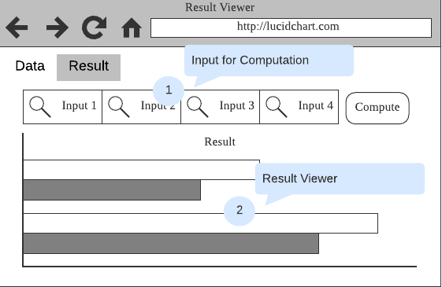
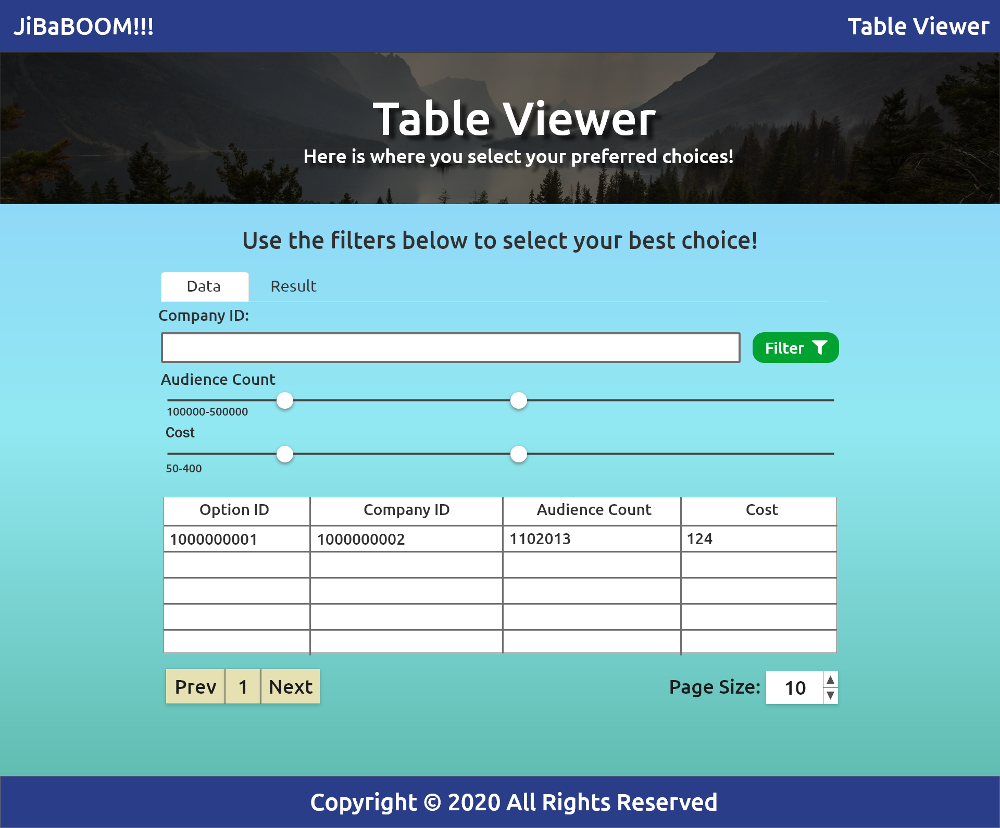

# Wireframe & Justification

This document should help you explain how your user interfaces are designed. You should have a wireframe to give a good overview and some screenshot with simple writeups to justify your designs.

## Wireframe

> This is just an example, please find your own wireframe.

## Selected Wireframe

## Justifications

### Justification 1

> This is just an example, please find your own justifications.

#### Good Points

1. Attributes shown at top and bottom can be useful for big table.
2. Showing total number of entries can be useful for some instance.
3. Pagination tool meets requirement

#### Bad Points

1. May need more than 1 search bar as we need to search by multiple attributes
2. Data with many column may be bad.

### Justification 1

#### Good Points

1. A simple-looking table, with horizontal lines to separate the rows from each other.
2. The user is able to click on a column to sort through the list of data.
3. A few columns in the table may be good enough.
4. Also shows the current and total number of entries in the data table.

#### Bad Points

1. The pagination tool needs to have numbers such that the user will know which page to go next.
2. The table needs needs to have at least a few inputs for filtering through the data.
3. The column header text are not bold enough for users to know that those are the column headers.

### Justification 2

> Find more existing work for reference.

#### Good Points

1. The pagination tool at least fits the requirement.
2. Good color identifiers to easily identify what is the function of each button
3. Minimalistic design of the table
4. Able to click on the headers to arrrange the data by its column.

#### Bad Points

1. There can be one or more filters to filter out more data, instead of just one search bar
2. The 'ID' column in the table may be unecessary
3. May be better if it shows the total number of entries.
4. Column ordering arrows are not present if they are not selected

### Justification 3

> Find more existing work for reference.

#### Good Points

1. A range of buttons on top of the table can be useful.
2. Pagination tool fits the requirements.
3. A checkbox on every row may be useful if the user wants to select particular rows of data.

#### Bad Points

1. The gradient on top of the table may make the design of the table inconsistent.
2. There can also be more inputs for filtering.
3. It can be better to show the number of entries the data has.